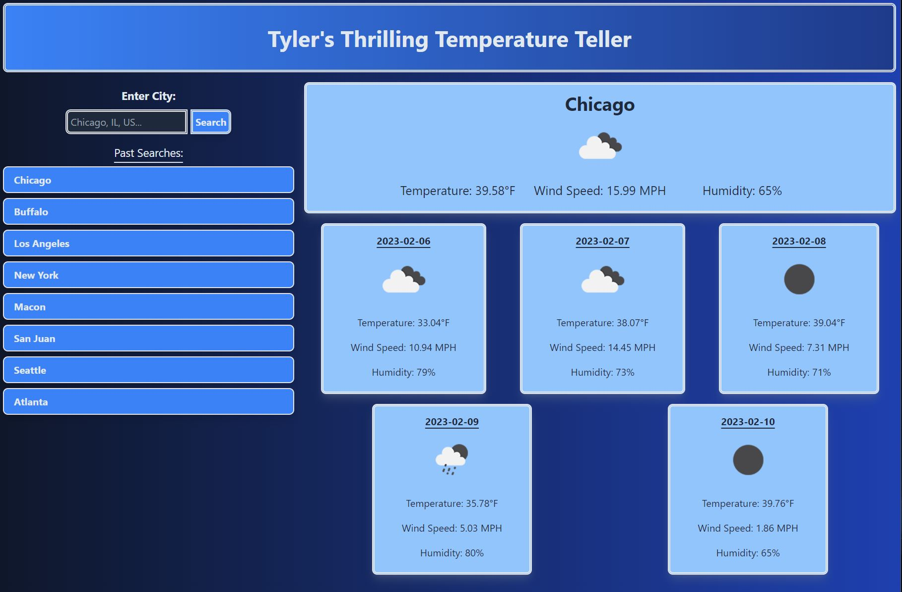

## Weather Dashboard Challenge 6

## Description

This application is designed to be a quick and intuitive way for a user to view the weather up to five days in advance for thousands of cities across the globe. After searching a city of the users choice, they are then presented with six cards. The top card shows the city name, the current weather conditions, the temperature in fahrenheit, the wind speed in MPH, and the humidity. The bottom five cards then show these same conditions for five days in advance of the current day. The user can also see their previously searched cities and click on them to have the weather for those locations appear again.

## Usage

This application can be utilized in order to plan for future weather conditions across the globe. If a user plans to take a vacation somewhere outside their home city, they can then search up that city and pack accordingly to the predicited weather conditions.

## Image 1

## Link

https://tyler-hill.github.io/Weather-Dashboard-Ch-6/

## Credits

Tyler Hill 2023
